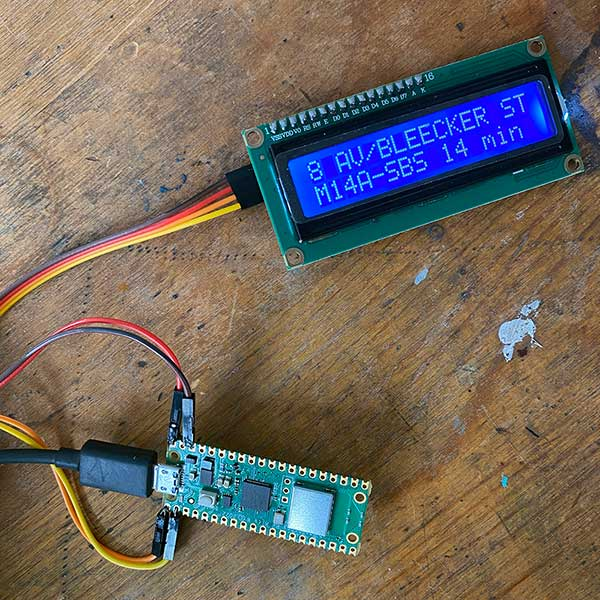

# PI BUS PICO

A Raspberry Pi Pico 2W with 16x2 LCD Screen NYC MTA One-stop Bus Tracker

Every morning will you be going to the same bus stop? Pain to look up on your phone. This little device will update you on arrival times for your near-to-home (or work) MTA bus stop.

Note: Project uses Micro Python and Thonny as IDE



## Setup
0. Get an API key from the MTA `https://register.developer.obanyc.com/`
1. Instead of an .env (dotenv library space constraints) make a `my_secrets.py` file with:
    - API_KEY= <the MTA API KEY you got>
    - STOP_ID= <find the stop id on the MTA website> i.e. 401608
    - KNOWN_NETWORKS={'ssid':'password', etc} <put your wifi networks here>
    - `LOCAL_OFFSET = -4 * 60 * 60  # for EDT (UTC-4) NYC!` 
2. Hardware:
    - I2C LCD1602 - uses 5 volts
    - Raspberry Pi Pico 2W
    - USB cable

---

## This Repo and workspace started with the 'Python Quick Setup Workspace'
by Nick Golebiewski
https://github.com/ngolebiewski/py_starter

## 📦 Virtual Environment
Activate:
```bash
source .venv/bin/activate
```

Deactivate:
```bash
deactivate
```
